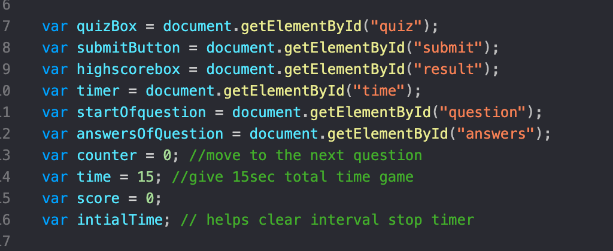
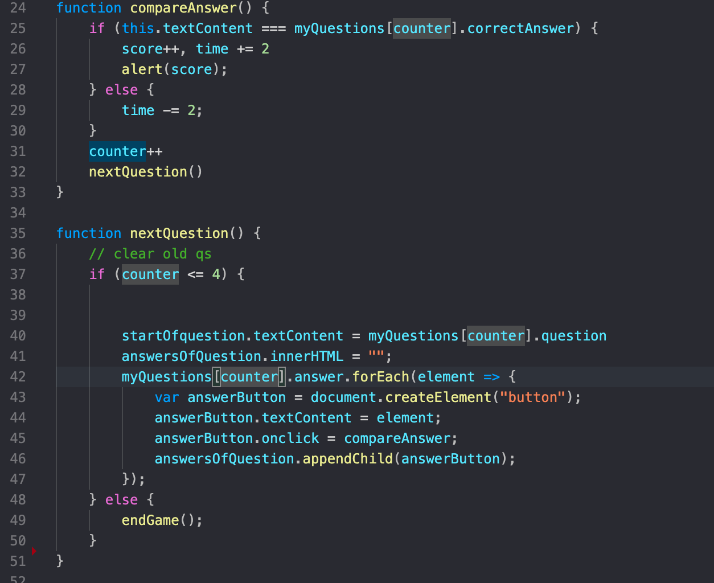

## Isaias's Code Quiz 

## Getting Started

These instructions will get you a copy of the project up and running on your local machine for development and testing purposes. See deployment for notes on how to deploy the project on a live system.

### Prerequisites

laptop>

Github account

Terminal for Mac

Gitbash for PC

Download Visual Code Editor

Atom

### Installing
-Create GitHub account

-Go to your terminal and setup GitHub SSH

-Follow this link:https://help.github.com/en/github/authenticating-to-github/adding-a-new-ssh-key-to-your-github-account

-Once you've completed creating ssh here's the link to my porfolio: hhttps://github.com/idelmundo/portfolio

-Clone SSH key and save the file in your desktop or documnet.

-Open terminal and go to the folder you've created for example: <href="https://user-images.githubusercontent.com/64993651/84466315-ff014300-ac2d-11ea-885d-10cfc0ee06e6.png"> from here Visual code should open with the folder on the side bar.

### Steps on what each does

Lines 7-16, Im setting up my variables that way I can point to this later on my code. on line 7-12, I'm pointing to my HTML so that way I can put stuff in there later such as time, questions and high score. Then on line 13-16 I set my variables for counter,time and score.  Here's an example:
  

 

 Lines 19-51, I started with a function called start I will be using this later on my code and i also added my initial time so that when the game starts it in seconds whihc is on my line 14. I also added nextQuestion() means i want you to run this function on line 35. On line 24-33 I have my compareAnswer function where I build a counter if the answer is correct add a score and time but if its wrong reduce time then it goes to the next question. In line 35-51 I made another function for nextQuestion were i will be placing my question into my html and added my counter so it knows when it done it will move to the next question. I also added a button element and had to append it so that way it can go to my html without it all this work in function will not work. on line 49 i also added endGame which will end the game after 5 questions.  Here's an example: 
  

## Built With

* [HTML](https://developer.mozilla.org/en-US/docs/Web/HTML)
* [CSS](https://developer.mozilla.org/en-US/docs/Web/CSS)
* [Javascript(https://developer.mozilla.org/en-US/docs/Glossary/JavaScript)

## Deployed Link

* [See Live Site](https://idelmundo.github.io/Password-Generator/)

## Authors

* **Isaias Del Mundo** 

- [Link to Portfolio Site](https://idelmundo.github.io/portfolio/index.html)
- [Link to Github](https://github.com/idelmundo)
- [Link to LinkedIn](https://www.linkedin.com/in/isaiasdelmundo/

See also the list of [contributors](https://github.com/your/project/contributors) who participated in this project.

## License

This project is licensed under the MIT License 

## Acknowledgments

* Hat tip to anyone whose code, libraries, packages, or UI was used  / inspired from
* Inspiration
* etc
